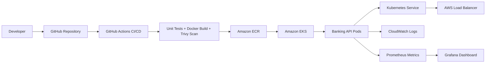

# Enterprise Banking DevOps Platform

A cloud-native banking reference project for a DevOps portfolio. It demonstrates how a financial-services application can be containerized, tested, secured, and deployed using **FastAPI, Docker, Kubernetes, Helm, Terraform, GitHub Actions, Prometheus, and Grafana**.

> Portfolio/reference project only. This is not an official Wells Fargo project and does not use real customer data.

## Use Cases

1. **Account Management** - View account details, balance, and status.
2. **Loan Processing** - Submit a loan request and receive an approval or review decision.
3. **Funds Transfer** - Validate and initiate money transfers between accounts.
4. **Transaction History** - Retrieve sample transactions for an account.
5. **Platform Health and Metrics** - Expose health and Prometheus metrics endpoints.

## Architecture



## DevOps Features

- Python FastAPI banking API.
- Dockerfile for containerization.
- Kubernetes Deployment, Service, ConfigMap, Secret, Ingress, and HPA.
- Helm chart for reusable deployments.
- GitHub Actions workflow with test, build, and Trivy scan stages.
- Terraform starter for ECR infrastructure.
- Demo script for interview explanation.

## Run Locally

```bash
python -m venv .venv
source .venv/bin/activate
pip install -r requirements.txt
uvicorn app.main:app --reload
```

Open `http://localhost:8000/docs`.

## Docker

```bash
docker build -t enterprise-banking-api:local .
docker run -p 8000:8000 enterprise-banking-api:local
```

## Kubernetes

```bash
kubectl apply -f k8s/namespace.yaml
kubectl apply -f k8s/
kubectl get pods -n banking
kubectl port-forward svc/banking-api-service 8080:80 -n banking
```

## Interview Explanation

I built a banking-domain DevOps project that simulates account management, loan processing, funds transfer, transaction history, and platform health APIs. My main focus was the DevOps lifecycle: Docker image creation, CI/CD automation, Kubernetes deployment, Helm packaging, Terraform infrastructure preparation, security scanning, and monitoring readiness.

## My Role

As a DevOps Engineer, I containerized the service, wrote Kubernetes manifests, created the CI/CD workflow, added security scanning, prepared Terraform infrastructure, and documented the production deployment approach.
